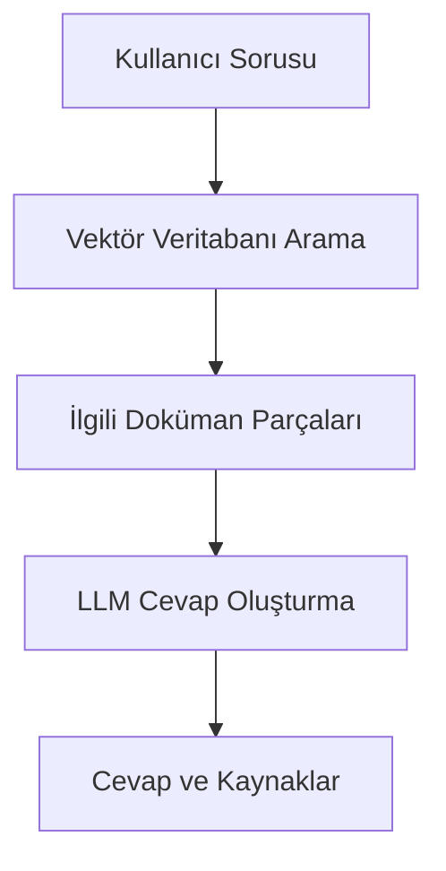

# CengAI - Türk Bina Deprem Yönetmeliği Sohbet Asistanı


Türk inşaat mühendisleri için geliştirilmiş, Türk Bina Deprem Yönetmeliği 2018 (TBDY 2018) dokümanıyla etkileşim kurmayı sağlayan RAG tabanlı sohbet asistanı.

## Özellikler

- TBDY 2018 dokümanı üzerinde doğal dil sorguları
- Türkçe dil desteği
- Doküman referanslı cevaplar
- Kaynak sayfa gösterimi
- Gerçek zamanlı vektör veritabanı güncellemesi

## Teknik Özellikler

- **Doküman İşleme**: PDF dokümanlarını işleme ve vektörleştirme
- **Vektör Veritabanı**: FAISS ile etkili benzerlik araması
- **LLM Modeli**: Groq üzerinde çalışan Llama-3-70b modeli
- **Gömme Modeli**: OpenAI text-embedding-3-small

## Kurulum

1. Gereksinimleri yükleyin:
```bash
pip install -r requirements.txt
```

2. API anahtarlarını ayarlayın:
```bash
export OPENAI_API_KEY="your_openai_key"
export GROQ_API_KEY="your_groq_key"
```

Veya `.streamlit/secrets.toml` dosyası oluşturun:
```toml
OPENAI_API_KEY = "your_openai_key"
GROQ_API_KEY = "your_groq_key"
```

3. Uygulamayı çalıştırın:
```bash
streamlit run main.py
```

## Kullanım

1. Uygulamayı başlattıktan sonra tarayıcınızda otomatik açılacaktır
2. Türkçe olarak TBDY 2018 ile ilgili sorularınızı girin
3. Örnek sorular:
   - "TBDY 2018'e göre deprem tasarım sınıfları nelerdir?"
   - "Betonarme yapılarda kolon donatı kuralları nelerdir?"
   - "Deprem yükleri nasıl hesaplanır?"

## Mimarı



1. PDF dokümanı parçalara ayrılır ve vektörleştirilir
2. Kullanıcı sorusu vektör uzayında aranır
3. En ilgili 5 doküman parçası seçilir
4. LLM modeli bu parçaları kullanarak cevap oluşturur

## Geliştirme

### Bağımlılıklar

- Python 3.9+
- Streamlit
- LangChain
- FAISS
- OpenAI Embeddings
- Groq API

### Doküman Güncelleme

Yeni doküman eklemek için:
1. PDF dosyasını `Documents/` klasörüne ekleyin
2. `main.py` dosyasında `DEFAULT_PDF_PATH` değişkenini güncelleyin

## Lisans

MIT Lisansı - Detaylar için LICENSE dosyasına bakınız.
